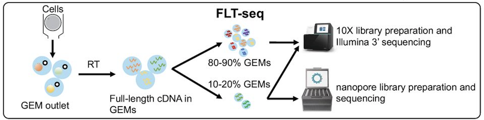
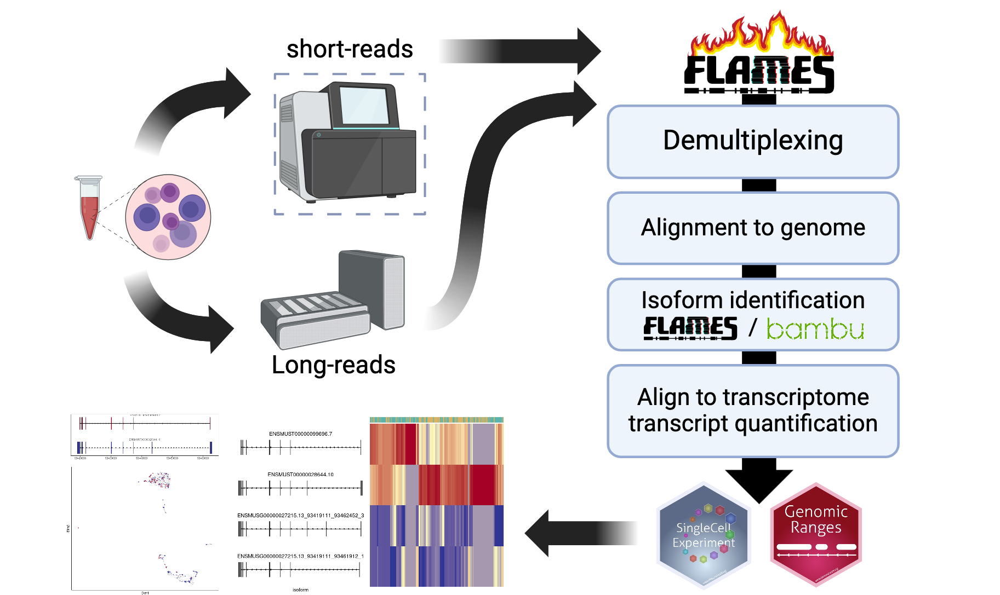
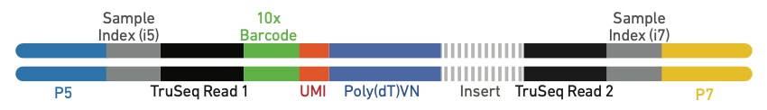
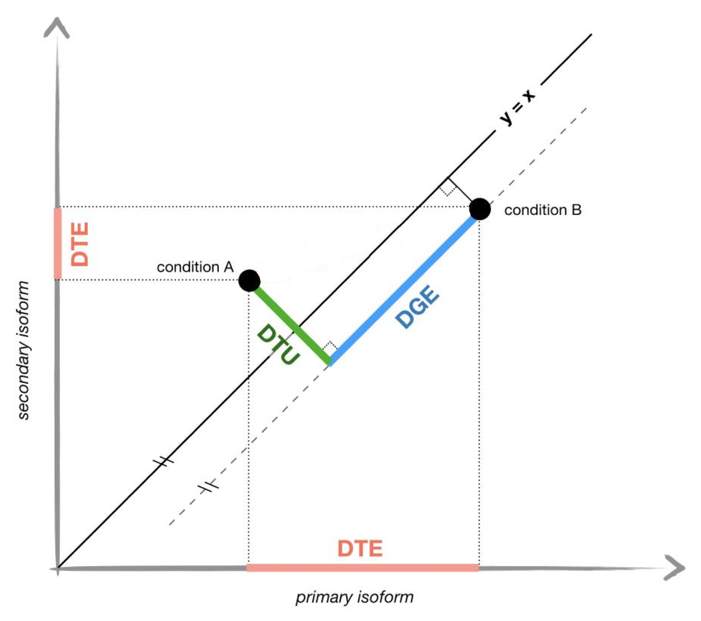

# Abstract
In this vignette, we will walk through the `FLAMES` single-cell pipeline, from 
de-multiplexing raw FASTQ files to identifying and quantifying transcripts. We
then perform analysis including single nucleotide polymorphism (SNP), 
differential transcript expression analysis and differential transcript usage 
analysis. We will use the cell line mixture data from Tian *et al.*
[@tianComprehensiveCharacterizationSinglecell2021].

# Introduction
While the popular single-cell kits allows profiling the transcriptome of up to
10,000 cells [@WhatMaximumNumber] at once, the traditional short-read sequencing
(100-200 nts) limits our ability to unambiguously profile **isoform expression**
and **mutations**. To overcome this issue, we can combine long-read sequencing 
with existing single-cell kits.

Though long-read sequencing can provide read lengths several orders of magnitude
larger than the typical short-read sequencing, it comes at much steeper cost and
lower throughput, to accommodate this, we profile a smaller sub-sample of cells 
in our *FLT-seq* protocol[@tianComprehensiveCharacterizationSinglecell2021]:
{width=800px}

There are also many other protocols that combine single-cell with long-read
sequencing, including *scRaCH-seq* which profiles gene panel
[@pengSinglecellRapidCapture2024], *LR-Split-seq* which uses combinatorial
barcoding and does not require microfluidic equipments
[@rebboahMappingModelingGenomic2021].

# Set-up

```{r setup0, message=FALSE, echo = FALSE}
options(digits=3)
options(width=90)
```

```{r downloads, message=FALSE}
if (!file.exists("~/filtered_sorted.bam") | !file.exists("~/filtered_sorted.bam.bai")) {
  options(timeout = max(600, getOption("timeout")))
  download.file("https://zenodo.org/records/12751214/files/filtered_sorted.bam?download=1", "filtered_sorted.bam", mode = 'wb')
  download.file("https://zenodo.org/records/12751214/files/filtered_sorted.bam.bai?download=1", "filtered_sorted.bam.bai", mode = 'wb')
  bam <- "filtered_sorted.bam"
} else {
  bam <- path.expand("~/filtered_sorted.bam")
}

if (!file.exists("~/subset_GRCh38.fa")) {
  download.file("https://ftp.ebi.ac.uk/pub/databases/gencode/Gencode_human/release_47/GRCh38.primary_assembly.genome.fa.gz", "GRCh38.primary_assembly.genome.fa.gz", mode = 'wb')
  genome <- Biostrings::readDNAStringSet("GRCh38.primary_assembly.genome.fa.gz")
  names(genome) <- sapply(names(genome), function(x) strsplit(x, " ")[[1]][1])
  chr19 <- genome[genome$names == "chr19"]
  Biostrings::writeXStringSet(chr19, "~/subset_GRCh38.fa")
}
fa <- path.expand("~/subset_GRCh38.fa")

if (!file.exists("~/sce_lib10.qs") | !file.exists("~/sce_lib90.qs")) {
  download.file("https://zenodo.org/records/12770737/files/sce_lib10.qs?download=1", "sce_lib10.qs", mode = 'wb')
  download.file("https://zenodo.org/records/12770737/files/sce_lib90.qs?download=1", "sce_lib90.qs", mode = 'wb')
  sce_lib10 <- qs::qread("sce_lib10.qs")
  sce_lib90 <- qs::qread("sce_lib90.qs")
} else {
  sce_lib10 <- qs::qread("~/sce_lib10.qs")
  sce_lib90 <- qs::qread("~/sce_lib90.qs")
}
```

```{r setup, eval=TRUE, message=FALSE}
library(FLAMES)
library(SingleCellExperiment)
library(scater)
library(tidyverse)
library(ggplot2)
library(edgeR)
library(limma)
```

# `FLAMES` pipeline
{width=800px}

## Read pre-processing

The `FLAMES` pipeline starts with de-multiplexing the FASTQ reads, i.e.
identifiying the cell barcode. For protocols that use the 10x single-cell kits,
the raw reads will look like the following, where the 10x adapter sequences and
polyT tails are highlighted.
](viewer_mode.png){width=800px}  
{width=800px}

`FLAMES` will locate the cell barcode by locating the adjacent adapter sequences
, and match the barcode against an allow-list (if it is provided).
We can specify the above 10x 3' protocol as follows:
```{r pattern}
protocol_pattern <- c(
  primer = "CTACACGACGCTCTTCCGATCT",
  BC = "NNNNNNNNNNNNNNNN",
  UMI = "NNNNNNNNNNNN", 
  polyT = "TTTTTTTTT"
)
```
Note that the order has to be the same as they appear in the protocol. The names
can be arbitrary for each sequence, but the names **`UMI` and `BC` are required**
.

Let's try de-multiplexing a couple reads with `FLAMES::find_barcode`:
```{r barcode}
outdir <- tempfile()
dir.create(outdir)

# prepare a barcode allow-list
bc_allow <- file.path(outdir, "bc_allow.tsv")
R.utils::gunzip(
  filename = system.file("extdata/bc_allow.tsv.gz", package = "FLAMES"), 
  destname = bc_allow, remove = FALSE
)

find_barcode(
  # raw fastq file to be de-multiplexed
  fastq = system.file("extdata/fastq", package = "FLAMES"),
  # outputs
  stats_out = file.path(outdir, "bc_stat"),
  reads_out = file.path(outdir, "demultiplexed.fq"),
  barcodes_file = bc_allow,
  pattern = protocol_pattern, # our protocol pattern
  threads = 1
)
```

`FLAMES` will find and trim the specified pattern, save the barcode and UMI to
the identifier field of the read, let check the first raw read:
```{r fastq_raw}
read_lines(system.file("extdata/fastq/musc_rps24.fastq.gz", package = "FLAMES"),
           n_max = 2)
```
and the first de-multiplexed read:
```{r fastq_demultiplexed}
read_lines(file.path(outdir, "demultiplexed.fq"), n_max = 2)
```

This was done with an Rcpp version of *flexiplex* 
[@chengFlexiplexVersatileDemultiplexer2024], and is equivalent to calling
using the native `flexiplex` command line tool with the following arguments:

```{bash flexiplex, eval=FALSE}
 ~/flexiplex/flexiplex -x CTACACGACGCTCTTCCGATCT \
  -b '????????????????' -u '????????????' -x TTTTTTTTT \
  -e 2 -f 8 -k bc_allow.tsv musc_rps24.fastq > main_out.fq
```

If cell barcodes are not known in advance, e.g. when there is no coupled
short-reads, the `BLAZE` tool [@youIdentificationCellBarcodes2023] can
be used to identify the cell barcodes and UMI sequences , and `FLAMES`
also provides a wrapper `FLAMES::blaze` to call `BLAZE`.

```{r blaze, eval=FALSE}
blaze(
  100,
  fq_in = system.file("extdata/fastq/musc_rps24.fastq.gz", package = "FLAMES")
)
```

## Alignment
Once the reads are processed, they are ready to be aligned to the reference 
genome. `FLAMES` calls `minimap2` [@liMinimap2PairwiseAlignment2018] to
perform alignment and `samtoools` [@liSequenceAlignmentMap2009] to sort 
and index the BAM file, so we need to make sure the binaries are available in 
`$PATH` for `FLAMES` to find it.
```{r alignemnt, eval=FALSE}
minimap2_align(
    config = jsonlite::fromJSON(
      system.file('extdata', 'config_sclr_nanopore_3end.json', package = 'FLAMES')
    ),
    fa_file = fa,
    fq_in = file.path(outdir, "demultiplexed.fq"),
    annot = system.file("extdata", "filtered.gtf", package = "IgniteRNAseq"),
    outdir = outdir
)
```

`FLAMES` then performs gene quantification, isoform identification and isoform
quantification. For the interest of time we will skip running them individually,
as `FLAMES` also provides the `sc_long_pipeline` wrapper to do all steps. It will
return a `SingleCellExperiment` object with the isoform counts, and the isoform
annotations stored in the `rowRanges` slot. Let's run the pipeline with a small
number of reads:

```{r sc_long_pipeline, eval=FALSE}
sce <- FLAMES::sc_long_pipeline(
  genome_fa = system.file("extdata/rps24.fa.gz", package = "FLAMES"),
  fastq = system.file("extdata/fastq/musc_rps24.fastq.gz", package = "FLAMES"),
  annotation = system.file("extdata/rps24.gtf.gz", package = "FLAMES"),
  outdir = outdir,
  barcodes_file = bc_allow
)
```

# Data pre-processing 
After running the pipeline, we get a `SingleCellExperiment` object and we can
finally start some analysis. Let's load the `SingleCellExperiment` object from
our previous cell line mixture data [@tianComprehensiveCharacterizationSinglecell2021].

```{r load_data}
sce <- qs::qread(system.file("extdata", "sce.qs", package = "IgniteRNAseq"))
sce
altExp(sce, 'gene')
```

I have also attached the gene count matrix from long-reads to the `altExp` slot.
Let's do clustering with the gene counts, using Bioconductor packages for
normalization, dimensionality reduction and clustering:

```{r sce_preprocessing}
altExp(sce, 'gene') <- altExp(sce, 'gene') |>
  scuttle::logNormCounts() |>
  scater::runPCA() |>
  scater::runUMAP()

sce$cluster <- scran::buildSNNGraph(altExp(sce, 'gene')) |>
  igraph::cluster_leiden() |>
  igraph::membership() |>
  factor()

altExp(sce, 'gene')$cluster <- sce$cluster

scater::plotReducedDim(altExp(sce, 'gene'), 'UMAP', colour_by = 'sizeFactor')
scater::plotReducedDim(altExp(sce, 'gene'), 'UMAP', colour_by = 'cluster')
```

```{r sce_preprocessing2}
# sce <- qs::qread(system.file("extdata", "processed_sce.qs", package = "IgniteRNAseq"))
download.file("https://raw.githubusercontent.com/ChangqingW/IgniteRNAseq/devel/inst/extdata/processed_sce.qs", "processed_sce.qs", mode = 'wb')
sce <- qs::qread("processed_sce.qs")
scater::plotReducedDim(altExp(sce, 'gene'), 'UMAP', colour_by = 'sizeFactor')
scater::plotReducedDim(altExp(sce, 'gene'), 'UMAP', colour_by = 'cluster')
```

We can clearly see the five cell lines are identified by the clustering using
the gene counts from the long-reads. Now let's see if we can get mutations / 
isoforms specific to each cell line.

# Mutation analysis 

## Mutation discovery
Let's suppose we no nothing about the mutations in our cell lines, we can use
the `FLAMES::find_variants` function get bulk mutation count (similar to the
`samtools mpileup` command, but in a tibble format with extra information):

```{r mutation_discovery}
mutation_discovery_tb <- FLAMES::find_variants(
  bam,
  fa,
  system.file("extdata", "filtered.gtf", package = "IgniteRNAseq"),
  min_nucleotide_depth = 2000,
  annotated_region_only = TRUE,
  names_from = "gene_name",
  threads = 4
)

mutation_discovery_tb
```

Since this is Nanopore sequencing, there ones with very low alternative allele
frequency are likely to be sequencing errors; Nanopore is also known to have
higher error rate in homopolymer regions, so we can filter out those as well:

```{r mutation_discovery_filter}
mutation_discovery_tb <- mutation_discovery_tb |>
  filter(freq > 0.2, freq < 0.8) |>
  arrange(desc(count))

mutation_discovery_tb
```

As we can see, there is a couple of potential SNP mutations, let's see if they
are correlated with our clustering.

## Mutation calling
The previous `find_variants` function is for bulk mutation calling, but since
we have **single-cell long-reads**, we can call mutations at the single-cell
level, and associate them with transcription profiles.

`FLAMES` offers the `sc_mutations` function to call mutations at the single-cell
level:
```{r mutation_calling}
snps_tb <- FLAMES::sc_mutations(
  bam,
  seqnames = as.character(mutation_discovery_tb$seqnames),
  positions = mutation_discovery_tb$pos,
  indel = F,
  barcodes = colnames(sce),
  threads = 4
)
```

Lets visualize the SNP status of each cell on the long-read derived UMAP. We
will color the cell by the allele that is supported by more than half of the 
reads from that cell. This can be done easily with some tidyverse functions. 
The cell lines are homozygous, but with e.g. cancer data this could require more
considerations.

```{r view_mutations}
head(snps_tb)

chr19 <- snps_tb |>
  filter(allele_count > 0, pct > 0.5) |>
  filter(seqname == 'chr19', pos == 48965830)
chr19 <- chr19[match(colnames(sce), chr19$barcode),"allele"] |>
 as.data.frame()
scater::plotReducedDim(altExp(sce, 'gene'), 'UMAP', colour_by = chr19)

chrM_7028 <- snps_tb |>
  filter(allele_count > 0, pct > 0.5) |>
  filter(seqname == 'chrM', pos == 7028)
chrM_7028 <- chrM_7028[match(colnames(sce), chrM_7028$barcode),"allele"] |>
 as.data.frame()
scater::plotReducedDim(altExp(sce, 'gene'), 'UMAP', colour_by = chrM_7028)

chrM_8251 <- snps_tb |>
  filter(allele_count > 0, pct > 0.5) |>
  filter(seqname == 'chrM', pos == 8251)
chrM_8251 <- chrM_8251[match(colnames(sce), chrM_8251$barcode),"allele"] |>
 as.data.frame()
scater::plotReducedDim(altExp(sce, 'gene'), 'UMAP', colour_by = chrM_8251)

chrM_9123 <- snps_tb |>
  filter(allele_count > 0, pct > 0.5) |>
  filter(seqname == 'chrM', pos == 9123)
chrM_9123 <- chrM_9123[match(colnames(sce), chrM_9123$barcode),"allele"] |>
 as.data.frame()
scater::plotReducedDim(altExp(sce, 'gene'), 'UMAP', colour_by = chrM_9123)

chrM_11719 <- snps_tb |>
  filter(allele_count > 0, pct > 0.5) |>
  filter(seqname == 'chrM', pos == 11719)
chrM_11719 <- chrM_11719[match(colnames(sce), chrM_11719$barcode),"allele"] |>
 as.data.frame()
scater::plotReducedDim(altExp(sce, 'gene'), 'UMAP', colour_by = chrM_11719)
```

# Differential Transcript Experssion analysis
Since we have the transcript count matrix from `FLAMES`, we can do some DTE
analysis. Let's pretend that instead of cell lines, we have two replicate samples,
and we devide the cells in each sample by a SNP mutation status. We can use
`limma` to find differentially transcribed genes in the mutated vs reference cells.

First we need to aggregate the counts to pseudo-bulk samples:
```{r MDS}
# aggregate to pseudo-bulk counts
pseudo_bulk <- counts(sce) |> 
    t() |>
    as.matrix() |>
    by(sce$cluster, colSums) |>
    sapply(identity) |>
    by(rownames(counts(sce)), colSums) |>
    sapply(identity) |>
    t()

dgelist <- DGEList(
  # throw out one cell line to make this 2 vs 2
  counts = pseudo_bulk[, -2],
  group = factor(c("mutated", "reference", "mutated", "reference"))
)

# remove lowly expressed isoforms
dgelist <- dgelist[
  filterByExpr(dgelist), , 
  keep.lib.sizes = FALSE
]

# visualize the pseudo-bulk samples
plotMDS(dgelist)
```

Looks like there is some within-group variation as well as
between-group variation. Let's use `limma` to find significantly
differentiated expressed transcripts between the mutated and reference cells.

```{r DTE}
dgelist <- calcNormFactors(dgelist, method = "TMM")
# means model
design <- model.matrix(~ 0 + dgelist$samples$group, data = dgelist$samples)
colnames(design) <- gsub(".*\\$", "", colnames(design)) |>
  gsub(" .*$", "", x = _)
dge_v <- voom(dgelist, design, save.plot = T, plot = F, span = 0.2)
efit <- lmFit(dge_v, dge_v$design) |>
  contrasts.fit(contrasts = makeContrasts(
    MalevsFemale = "groupmutated - groupreference",
    levels = dge_v$design
  )) |>
  eBayes()
topTable(efit)
```

Let's visualise the top differentially expressed transcript on the UMAP:
```{r}
scater::plotReducedDim(altExp(sce[, sce$cluster != 2], 'gene'), 'UMAP', 
  colour_by = data.frame(exp = counts(sce)['ENST00000621160.5', sce$cluster != 2]),
  shape_by =  "cluster"
)
```

# Differential Transcript Usage analysis
Previously we have identified the transcripts that are differentially expressed (
i.e. DTE), another question we can ask is whether there are differentiall
transcript usage (DTU) between the mutated and reference cells. The difference
between DTU and DTE is illustrated by the following figure, adapted from
[@ntranosDiscriminativeLearningApproach2019].
{width=800px}

The `sc_DTU_analysis` function can test for DTU (chi-squre test against uniform
distribution). It will ignore the transcription start site and end site differences
and only consider splicing differences.
```{r DTU1, message=FALSE, warning=FALSE, results = FALSE}
# The splice sites are saved in isoform_FSM_annotation.csv during
# isoform identification. Let's make sure it is available:
sce@metadata$OutputFiles$outdir <- tempdir()
download.file('https://zenodo.org/records/12751214/files/isoform_FSM_annotation.csv?download=1', 
              file.path(sce@metadata$OutputFiles$outdir, "isoform_FSM_annotation.csv"))

colLabels(sce) <- sce$cluster
dtu_df <- sc_DTU_analysis(sce)
```

We will get a data frame with the chi-square test results:
```{r DTU2}
head(dtu_df)
```

## Visualizations for DTU
Unlike DTE, DTU is a bit harder to visiuliaze. For experiments similar
to `FLT-seq`, where matching short-reads are available for both the
smaller sub-sample and the larger sub-sample, we provide some additional
plotting functions:

```{r sc_umap, eval=FALSE}
multiAssay <- combine_sce(
  sce_lib90,
  sce_lib10,
  sce
)
rowData(sce)[rowData(sce)$transcript_id =='ENST00000391751.7', ]
sc_umap_expression("ENSG00000170889.14", multiAssay)
```

```{r softwareinfo}
sessionInfo()
```

# References
