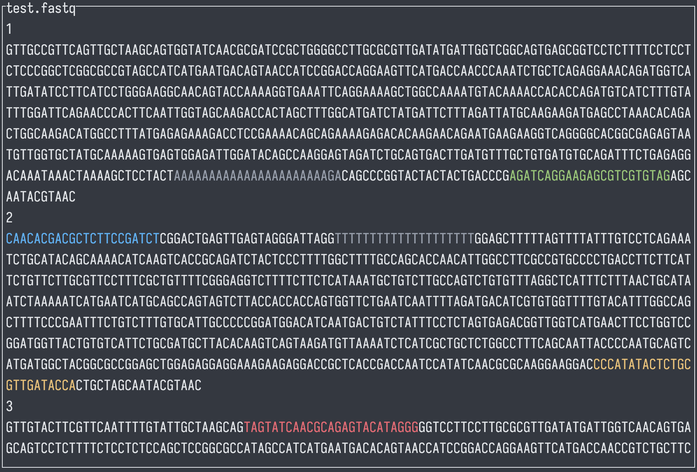

# Abstract
In this vignette, we will walk through the `FLAMES` single-cell pipeline, from 
de-multiplexing raw FASTQ files to identifying and quantifying transcripts. We
then perform analysis including single nucleotide polymorphism (SNP), 
differential transcript expression analysis and differential transcript usage 
analysis. We will use the cell line mixture data from Tian *et al.* (2021)
[@tianComprehensiveCharacterizationSinglecell2021].

# Introduction
While the popular single-cell kits allows profiling the transcriptome of up to
10,000 cells [@WhatMaximumNumber] at once, the traditional short-read sequencing
(100-200 nts) limits our ability to unambiguously profile **isoform expression**
and **mutations**. To overcome this issue, we can combine long-read sequencing 
with existing single-cell kits.

Though long-read sequencing can provide read lengths several orders of magnitude
larger than the typical short-read sequencing, it comes at much steeper cost and
lower throughput, to accommodate this, we profile a smaller sub-sample of cells 
in our *FLT-seq* protocol[@tianComprehensiveCharacterizationSinglecell2021]:
{width=800px}

There are also many other protocols that combine single-cell with long-read
sequencing, including *scRaCH-seq* which profiles gene panel
[@pengSinglecellRapidCapture2024], *LR-Split-seq* which uses combinatorial
barcoding and does not require microfluidic equipments
[@rebboahMappingModelingGenomic2021].

# Set-up

```{r setup0, message=FALSE, echo = FALSE}
options(digits=3)
options(width=90)
```

```{r downloads}
if (!file.exists("~/filtered_sorted.bam") | !file.exists("~/filtered_sorted.bam.bai")) {
  options(timeout = max(600, getOption("timeout")))
  download.file("https://zenodo.org/records/12751214/files/filtered_sorted.bam?download=1", "filtered_sorted.bam", mode = 'wb')
  download.file("https://zenodo.org/records/12751214/files/filtered_sorted.bam.bai?download=1", "filtered_sorted.bam.bai", mode = 'wb')
  bam <- "filtered_sorted.bam"
} else {
  bam <- "~/filtered_sorted.bam"
}

if (!file.exists("~/subset_GRCh38.fa")) {
  download.file("https://zenodo.org/records/12751214/files/subset_GRCh38.fa.gz?download=1", "subset_GRCh38.fa.gz", mode = 'wb')
  R.utils::gunzip("subset_GRCh38.fa.gz", destname = "subset_GRCh38.fa", remove = FALSE)
  fa <- "subset_GRCh38.fa"
} else {
  fa <- "~/subset_GRCh38.fa"
}
```

```{r setup, eval=TRUE, message=FALSE}
library(FLAMES)
library(SingleCellExperiment)
library(scater)
library(tidyverse)
library(ggplot2)
library(edgeR)
library(limma)
```

# `FLAMES` pipeline
{width=800px}

## Read pre-processing

The `FLAMES` pipeline starts with de-multiplexing the FASTQ reads, i.e.
identifiying the cell barcode. For protocols that use the 10x single-cell kits,
the raw reads will look like the following, where the 10x adapter sequences and
polyT tails are highlighted.
{width=800px}
{width=800px}

`FLAMES` will locate the cell barcode by locating the adjacent adapter sequences
, and match the barcode against an allow-list (if it is provided).
We can specify the above 10x 3' protocol as follows:
```{r pattern}
protocol_pattern <- c(
  primer = "CTACACGACGCTCTTCCGATCT",
  BC = "NNNNNNNNNNNNNNNN",
  UMI = "NNNNNNNNNNNN", 
  polyT = "TTTTTTTTT"
)
```
Note that the order has to be the same as they appear in the protocol. The names
can be arbitrary for each sequence, but the names **`UMI` and `BC` are required**
.

Let's try de-multiplexing a couple reads with `FLAMES::find_barcode`:
```{r barcode}
outdir <- tempfile()
dir.create(outdir)

# prepare a barcode allow-list
bc_allow <- file.path(outdir, "bc_allow.tsv")
R.utils::gunzip(
  filename = system.file("extdata/bc_allow.tsv.gz", package = "FLAMES"), 
  destname = bc_allow, remove = FALSE
)

find_barcode(
  # raw fastq file to be de-multiplexed
  fastq = system.file("extdata/fastq", package = "FLAMES"),
  # outputs
  stats_out = file.path(outdir, "bc_stat"),
  reads_out = file.path(outdir, "demultiplexed.fq"),
  barcodes_file = bc_allow,
  pattern = protocol_pattern, # our protocol pattern
  threads = 1
)
```

`FLAMES` will find and trim the specified pattern, save the barcode and UMI to
the identifier field of the read, let check the first raw read:
```{r fastq_raw}
read_lines(system.file("extdata/fastq/musc_rps24.fastq.gz", package = "FLAMES"),
           n_max = 2)
```
and the first de-multiplexed read:
```{r fastq_demultiplexed}
read_lines(file.path(outdir, "demultiplexed.fq"), n_max = 2)
```

## Alignment
Once the reads are processed, they are ready to be aligned to the reference 
genome. `FLAMES` calls `minimap2` to perform alignment and `samtoools` to sort 
and index the BAM file, so we need to make sure the binaries are available in 
`$PATH` for `FLAMES` to find it.
```{r alignemnt, eval=FALSE}
if (!any(is.na(sys_which(c("minimap2", "k8"))))) {
    minimap2_align(
        config = jsonlite::fromJSON(
          system.file('extdata/SIRV_config_default.json', package = 'FLAMES')
        ),
        fa_file = fa,
        fq_in = file.path(outdir, "demultiplexed.fq"),
        annot = system.file("extdata", "filtered.gtf", package = "IgniteRNAseq"),
        outdir = outdir
    )
}
```

`FLAMES` then performs gene quantification, isoform identification and isoform
quantification. For the interest of time we will skip running them individually,
as `FLAMES` also provides the `sc_long_pipeline` wrapper to do all steps.

```{r sc_long_pipeline, eval=FALSE}
sce <- FLAMES::sc_long_pipeline(
  genome_fa = fa,
  fastq = system.file("extdata/fastq/musc_rps24.fastq.gz", package = "FLAMES"),
  annotation = system.file("extdata/rps24.gtf.gz", package = "FLAMES"),
  outdir = outdir,
  barcodes_file = bc_allow,
  minimap2 = '~/k8-1.2/k8-x86_64-Linux', # apt does not package k8 with minimap2
)
```


# Data pre-processing 
After running the pipeline, we get a `SingleCellExperiment` object and we can
finally start some analysis.

```{r load_data}
sce <- qs::qread(system.file("extdata", "sce.qs", package = "IgniteRNAseq"))
sce
altExp(sce, 'gene')
```

We can use Bioconductor packages for normalization, dimensionality reduction and
clustering:
```{r sce_preprocessing}
altExp(sce, 'gene') <- altExp(sce, 'gene') |>
  scuttle::logNormCounts() |>
  scater::runPCA() |>
  scater::runUMAP()

sce$cluster <- scran::buildSNNGraph(altExp(sce, 'gene')) |>
  igraph::cluster_leiden() |>
  igraph::membership() |>
  factor()

altExp(sce, 'gene')$cluster <- sce$cluster

scater::plotReducedDim(altExp(sce, 'gene'), 'UMAP', colour_by = 'sizeFactor')
scater::plotReducedDim(altExp(sce, 'gene'), 'UMAP', colour_by = 'cluster')
```


# Mutation analysis 

## Mutation discovery
Next, we get the bulk allele count to see if there is any potential SNP mutation
in our data.

```{r mutation_discovery}
mutation_discovery_tb <- FLAMES::find_variants(
  bam,
  fa,
  system.file("extdata", "filtered.gtf", package = "IgniteRNAseq"),
  min_nucleotide_depth = 100,
  homopolymer_window = 3,
  annotated_region_only = TRUE,
  names_from = "gene_name",
  threads = 4
)

mutation_discovery_tb

mutation_discovery_tb <- mutation_discovery_tb |>
  filter(freq > 0.2, freq < 0.8) |>
  arrange(desc(count))

mutation_discovery_tb
```
As we can see, there is a couple of potential SNP mutations, let's see if they
are correlated with our clustering.

## Mutation calling
`FLAMES` offers the `sc_mutations` function to call mutations at the single-cell
level:
```{r mutation_calling}
snps_tb <- FLAMES::sc_mutations(
  bam,
  seqnames = as.character(mutation_discovery_tb$seqnames),
  positions = mutation_discovery_tb$pos,
  indel = F,
  barcodes = colnames(sce),
  threads = 4
)
```

Lets visualize the SNPs on our previous UMAP:
```{r view_mutations}
head(snps_tb)

chr19 <- snps_tb |>
  filter(allele_count > 0, pct > 0.5) |>
  filter(seqname == 'chr19', pos == 48965830)
chr19 <- chr19[match(colnames(sce), chr19$barcode),"allele"] |>
 as.data.frame()
scater::plotReducedDim(altExp(sce, 'gene'), 'UMAP', colour_by = chr19)

chrM_7028 <- snps_tb |>
  filter(allele_count > 0, pct > 0.5) |>
  filter(seqname == 'chrM', pos == 7028)
chrM_7028 <- chrM_7028[match(colnames(sce), chrM_7028$barcode),"allele"] |>
 as.data.frame()
scater::plotReducedDim(altExp(sce, 'gene'), 'UMAP', colour_by = chrM_7028)

chrM_8251 <- snps_tb |>
  filter(allele_count > 0, pct > 0.5) |>
  filter(seqname == 'chrM', pos == 8251)
chrM_8251 <- chrM_8251[match(colnames(sce), chrM_8251$barcode),"allele"] |>
 as.data.frame()
scater::plotReducedDim(altExp(sce, 'gene'), 'UMAP', colour_by = chrM_8251)

chrM_9123 <- snps_tb |>
  filter(allele_count > 0, pct > 0.5) |>
  filter(seqname == 'chrM', pos == 9123)
chrM_9123 <- chrM_9123[match(colnames(sce), chrM_9123$barcode),"allele"] |>
 as.data.frame()
scater::plotReducedDim(altExp(sce, 'gene'), 'UMAP', colour_by = chrM_9123)

chrM_11719 <- snps_tb |>
  filter(allele_count > 0, pct > 0.5) |>
  filter(seqname == 'chrM', pos == 11719)
chrM_11719 <- chrM_11719[match(colnames(sce), chrM_11719$barcode),"allele"] |>
 as.data.frame()
scater::plotReducedDim(altExp(sce, 'gene'), 'UMAP', colour_by = chrM_11719)
```

# Differential Transcript Experssion analysis
Since we have the transcript count matrix from `FLAMES`, we can do some DTE
analysis:
```{r DTE}
pseudo_bulk <- counts(sce) |> 
    t() |>
    as.matrix() |>
    by(sce$cluster, colSums) |>
    sapply(identity) |>
    by(rownames(counts(sce)), colSums) |>
    sapply(identity) |>
    t()

dgelist <- DGEList(
  counts = pseudo_bulk[, -2],
  group = factor(c("A", "B", "A", "B"))
)
dgelist <- dgelist[
  filterByExpr(dgelist), , # bias?
  keep.lib.sizes = FALSE
]
plotMDS(dgelist)

dgelist <- calcNormFactors(dgelist, method = "TMM")
# means model
design <- model.matrix(~ 0 + dgelist$samples$group, data = dgelist$samples)
colnames(design) <- gsub(".*\\$", "", colnames(design)) |>
  gsub(" .*$", "", x = _)
dge_v <- voom(dgelist, design, save.plot = T, plot = F, span = 0.2)
efit <- lmFit(dge_v, dge_v$design) |>
  contrasts.fit(contrasts = makeContrasts(
    MalevsFemale = "groupA - groupB",
    levels = dge_v$design
  )) |>
  eBayes()
topTable(efit)
```

```{r}
scater::plotReducedDim(altExp(sce[, sce$cluster != 2], 'gene'), 'UMAP', 
                       colour_by = data.frame(raw_expr = counts(sce)['ENST00000621160.5', sce$cluster != 2]))
```

# Differential Transcript Usage analysis
WIP
```{r}
sce@metadata$OutputFiles$outdir <- tempdir()
download.file('https://zenodo.org/records/12751214/files/isoform_FSM_annotation.csv?download=1', 
              file.path(sce@metadata$OutputFiles$outdir, "isoform_FSM_annotation.csv"))

colLabels(sce) <- sce$cluster
dtu_df <- sc_DTU_analysis(sce)
```

